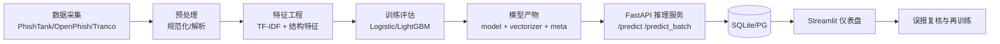

# 基于 Python 的恶意 URL 检测系统设计文档（本科毕设版）

## 1. 执行摘要
本文给出一套适用于“单人、3–4 个月、本科毕设”的恶意 URL 检测系统方案，覆盖：
- 数据采集（PhishTank/OpenPhish/Tranco）；
- 预处理与特征工程（URL 规范化 + 字符 n-gram TF-IDF + 结构特征）；
- 模型训练与评估（Logistic/LightGBM，含阈值校准）；
- 在线推理（FastAPI）与可视化（Streamlit）；
- 漂移监控、误报闭环与可复现部署（Docker Compose）。

设计优先“低成本可落地”：先完成强基线闭环（TF-IDF + Logistic），再迭代外部情报（RDAP/DNS/VirusTotal）和深度模型（Transformer/GNN）。

---

## 2. 需求边界与关键假设

### 2.1 已知边界
- 目标：在较低误报（FPR）下保持较高召回（TPR/Recall）。
- 时延：单条 URL 推理目标 50–200ms（单机）。
- 安全：尽量不主动抓取网页正文，降低访问恶意站点风险。

### 2.2 假设（论文未给定时）
- 方法假设：URL 特征 + 机器学习为主，深度学习为增强实验。
- 数据规模：正负样本各 3–10 万起步。
- 形态假设：离线训练 + 在线推理 API + 仪表盘。
- 部署假设：本地 Docker Compose 一键启动。
- 合规假设：默认最小化存储，优先脱敏 URL query。

---

## 3. 技术路线与权衡

| 层级 | 方案 | 准确性潜力 | 在线效率 | 实现难度 | 建议 |
|---|---|---|---|---|---|
| MVP | TF-IDF(char n-gram) + Logistic | 中高 | 高 | 低 | 首选强基线 |
| MVP+ | TF-IDF + LightGBM + 结构特征 | 中高 | 中 | 中 | 第二阶段对比 |
| 增强 | RDAP/DNS/VT 外部特征 | 中高 | 低~中 | 中 | 异步补全 + 缓存 |
| 研究增强 | Transformer/GNN | 高 | 低~中 | 高 | 作为论文创新扩展 |

> 重点：跨数据源评估与时间切分必须纳入核心实验，避免“同分布高分、跨源掉点”。

---

## 4. 总体架构

### 4.1 组件
1. 数据采集：OSINT feed + 正常域名榜单。  
2. 预处理：URL 标准化、解析、去重。  
3. 特征工程：TF-IDF + 结构特征拼接。  
4. 训练评估：AUC/F1/混淆矩阵/阈值扫描。  
5. 模型产物：模型、向量器、版本信息统一打包。  
6. 在线推理：FastAPI `/predict` 与 `/predict_batch`。  
7. 存储与可视化：SQLite + Streamlit 仪表盘。  
8. 反馈闭环：误报复核、定期再训练。  

### 4.2 架构图（Mermaid）

---

## 5. 模块设计（MVP）

### 5.1 数据采集
- 恶意：PhishTank、OpenPhish 社区 Feed。
- 正常：Tranco top sites 派生 URL。
- 数据字段建议：`url,label,source,ts,raw`。

### 5.2 预处理与去重
- 去 fragment、统一 scheme/host 大小写、去默认端口、处理编码。
- 以“规范化 URL”去重，防止重复样本污染评估。

### 5.3 特征工程
- 文本特征：字符 n-gram TF-IDF（推荐 3–5 gram）。
- 结构特征：长度、点数、数字比例、路径深度、参数个数、是否 IP 域名等。
- 拼接方式：`FeatureUnion([tfidf, struct])`。

### 5.4 模型训练
- 必做：`LogisticRegression(saga, class_weight='balanced')`。
- 选做：`LightGBM` 对比实验。
- 输出：`joblib` 模型文件 + 训练元数据（时间、参数、特征版本、阈值）。

### 5.5 在线推理 API
- `POST /api/v1/predict`：单条 URL。
- `POST /api/v1/predict_batch`：批量（建议 N<=200）。
- `GET /api/v1/model_info`：模型版本与训练信息。

### 5.6 仪表盘
- 页面最小集：总览、评估、样本浏览、误报分析。
- 指标：TP/FP/FN/TN、AUC、P95 延迟、恶意占比。

---

## 6. 评估与实验设计

### 6.1 必做指标
- Accuracy、Precision、Recall、F1、ROC-AUC；
- 固定低 FPR 下的 TPR（如 TPR@FPR=1% 或更低）。

### 6.2 数据划分原则
- 优先时间切分（train < val < test），防止未来信息泄漏；
- 做跨源测试（source A 训练，source B 测试）评估泛化。

### 6.3 阈值策略
- 在验证集做阈值扫描：
  - 若重召回：在 FPR 约束下最大化 Recall；
  - 若重误报：固定 FPR 后比较 TPR。

---

## 7. 安全、隐私与可靠性

- 隐私最小化：默认不存完整 query，或进行哈希/脱敏。
- 反滥用：速率限制、批量上限、鉴权、超时控制。
- 外部特征降级：RDAP/DNS/VT 失败时回退到 URL-only 模式。
- 可追溯：记录模型版本、阈值、输入摘要、耗时与结果。

---

## 8. 里程碑（14 周）

1. 第1–2周：需求与数据采集脚本。  
2. 第3–5周：预处理、特征、Logistic 基线。  
3. 第6–7周：误报分析与 LightGBM 对比。  
4. 第8–9周：FastAPI + Streamlit 原型。  
5. 第10–12周：阈值/灰度机制 + 部署复现。  
6. 第13–14周：论文、答辩材料、演示脚本。  

---

## 9. 交付清单（验收导向）

- 需求与假设说明文档；
- 数据采集与数据字典；
- 预处理模块与单元测试；
- 特征工程与配置；
- 训练与评估脚本；
- FastAPI 服务与 OpenAPI 文档；
- Streamlit 仪表盘；
- Docker Compose 一键启动与复现说明；
- 论文正文与附录（API 契约、部署步骤、实验日志）。

---

## 10. 建议结论

对本科毕设，最稳健路径是先交付 **“可复现强基线闭环”**：
**URL 特征 + TF-IDF + Logistic/LightGBM + API + 仪表盘 + 误报复盘**。  
在此基础上，用“跨源泛化、低 FPR 表现、漂移监控”构成论文亮点；若有余力再加入 RDAP 特征或 Transformer/GNN 对比实验。
